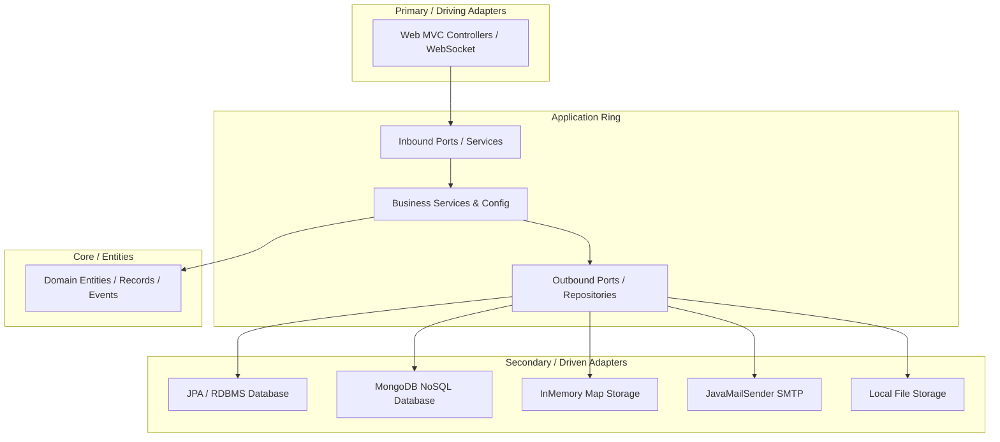

# Project Architecture & Guidelines (PROJECT.md)

Fast-food ordering system with a multi-persistence architecture, database-level field-level internationalization, and real-time dashboard updates.

---

## 1. Tech Stack Overview

*   **Backend**: Spring Boot 3.5.7, Java 25 (utilizing Records, Pattern Matching, and modern constructs)
*   **Templating & Rendering**: Thymeleaf server-side HTML rendering (HTML5/Bootstrap 5.3.0, Font Awesome 6.4.0)
*   **Persistence Profiles**: JPA (H2/PostgreSQL/MySQL), MongoDB, and InMemory (ConcurrentHashMap-based)
*   **Mail Engine**: Spring Mail integrated with Thymeleaf templates for localized text/HTML notification delivery
*   **Real-time Communication**: Spring WebSocket / STOMP for live order dashboard status synchronization

---

## 2. Hexagonal Architecture Implementation

The project is structured as a decoupled ports-and-adapters architecture to isolate core business rules from presentation layers, databases, and third-party APIs.



### Module Responsibilities

1.  **`domain`**:
    *   Contains business models (e.g., [Order.java](file:///d:/git/fastbite/fastbite/domain/src/main/java/es/brasatech/fastbite/domain/order/Order.java), [ProductDto.java](file:///d:/git/fastbite/fastbite/domain/src/main/java/es/brasatech/fastbite/domain/product/ProductDto.java)), custom exceptions, domain events, and core enums.
    *   No framework dependencies (e.g., JPA `@Entity` annotations, `@Document` annotations).
2.  **`application`**:
    *   Declares inbound ports (use cases like [OrderService.java](file:///d:/git/fastbite/fastbite/application/src/main/java/es/brasatech/fastbite/application/order/OrderService.java)) and outbound ports (SPI/Repositories like [EmailRepository.java](file:///d:/git/fastbite/fastbite/application/src/main/java/es/brasatech/fastbite/application/mail/EmailRepository.java)).
    *   Handles orchestration, transaction boundaries, and triggers domain/integration event dispatching.
3.  **`adapter-in` (`web`)**:
    *   Implements UI presentation layer using Thymeleaf, handling user requests, HTTP sessions, CSRF validation, and WebSocket mappings ([WebConfig.java](file:///d:/git/fastbite/fastbite/adapter-in/web/src/main/java/es/brasatech/fastbite/config/WebConfig.java), [OrderController.java](file:///d:/git/fastbite/fastbite/adapter-in/web/src/main/java/es/brasatech/fastbite/controller/OrderController.java)).
4.  **`adapter-out`**:
    *   Provides secondary adapter implementations, separated into technological sub-modules:
        *   `jpa`: Entity mappings, repository interfaces, and `*ServiceJpaImpl`.
        *   `email`: Localized Thymeleaf rendering and SMTP message transmission.
        *   `disk-filestorage`: Local filesystem persistence for uploaded media.

---

## 3. Multi-Persistence Strategy

The codebase switches its persistence mechanism transparently depending on the active Spring Profile: `inmemory` or `jpa`.

| Strategy | Profile | Package Pattern | Package Location | Excludes Configuration |
| :--- | :--- | :--- | :--- | :--- |
| **InMemory** | `inmemory` | `*.inmemory` | Located within adapters | Disables database auto-configuration |
| **JPA** | `jpa` | `*.jpa` | `adapter-out` module | - |

### Isolation Rules
*   **Strict Package Separation**: JPA classes must remain in `*.jpa` packages.
*   **Conditional Scanning**:
    *   [JpaConfig.java](file:///d:/git/fastbite/fastbite/adapter-out/jpa/src/main/java/es/brasatech/fastbite/jpa/order/JpaConfig.java) enables JPA repositories via `@EnableJpaRepositories` only when the `jpa` profile is active.

---

## 4. Internationalization (I18n) Architecture

The core tenet of FastBite's translation strategy is to **isolate translation data** to prevent overhead during queries in the default locale.

### Storage Strategy
*   **Main Tables/Collections**: Store default locale strings directly (e.g., `name`, `description`).
*   **Translation Tables/Collections**: Maintain translations mapped to the default record's ID, field name, and language code (e.g., `product_translations`, `customization_option_translations`).

### Query Flow & Fallbacks
1.  **Locale Check**: If `RequestedLocale == DefaultLocale`, the application bypasses translation tables entirely (**Fast Path**).
2.  **Fallback Check**: If `RequestedLocale != DefaultLocale`, the application queries translation tables.
    *   If a specific translation exists: The application merges it into the response DTO.
    *   If the translation is null or missing: It falls back to the default language field.
    *   If the default language field is missing: It resolves to `null`.

```
[Request with Locale "es"]
       │
       ▼
Is Spanish the Default? ── Yes ──► Return Default Entity Field (Fast Path)
       │
       No
       ▼
Query Spanish Translation Table ── Found? ── Yes ──► Return Translated Value
       │
       No
       ▼
Return Default Entity Field (Fallback)
```

### Order Customizer I18n
The customization options chosen in an order (e.g., "Extra Cheese") must be preserved in the order's language at the time of retrieval, but stored consistently inside the database.

*   **Order Save Process**:
    *   If `orderLanguage != defaultLanguage`: For every customizer option selected, look up the option ID in the repository, retrieve its name in the **default language**, and save it in default language text.
    *   If `orderLanguage == defaultLanguage`: Store customization option names directly.
*   **Order Retrieval Process**:
    *   If `orderLanguage == defaultLanguage`: Return stored data directly.
    *   If `orderLanguage != defaultLanguage`: Look up matching translations for each option ID from `CustomizationOptionTranslationRepository` using the `orderLanguage` key, replacing default names with translated names (falling back to default values if not translated).

---

## 5. Coding Standards & Restrictions

To keep the application highly consistent and support native GraalVM image compilation:

### Front-End & Javascript
*   ❌ **No Inline Styles**: All layouts must use Bootstrap 5 utility classes or classes declared in `menu.css`.
*   ❌ **No Local/Session Storage**: Session state (e.g., the user's cart) must be kept strictly on the HTTP server session.
*   ✅ **Strict Equality**: Always use `===` and `!==` in javascript scripts.
*   ✅ **Navigation**: Use `window.location.assign(url)` instead of modifying `.href` to prevent security issues.
*   ✅ **CSRF Protections**: All state-modifying requests (forms, AJAX POSTs) must pass the `_csrf` token header or parameter.

### Thymeleaf & Fragment Patterns
*   **Fragment Data Enrichment**: Avoid complex property evaluation (e.g., Enums, complex Records) within SpEL expression blocks inside fragments. Pre-process and format values (e.g., invoke `.name()` on enums, pre-calculate totals) within the controller before passing data to Thymeleaf fragments.
*   **AJAX Updates**: Retrieve server-side rendered HTML fragments via AJAX fetches, replacing DOM nodes rather than generating HTML markup client-side.

### AOT and Native Image Requirements
*   **Reflection Configuration**: Register all DTOs, domain models, and JSON-serialized records within [WebAdapterHints.java](file:///d:/git/fastbite/fastbite/adapter-in/web/src/main/java/es/brasatech/fastbite/config/WebAdapterHints.java) to guarantee reflective access in native images.

---

## 6. Hexagonal Architecture Improvement Suggestions

To fully leverage the hexagonal architecture and improve dynamic capability:

### A. Modular Feature Packages (Package-by-Feature)
Currently, code is organized in technical modules (`adapter-in`, `adapter-out`, `application`, `domain`) containing all features (e.g., `order`, `office`, `mail`) nested inside.
*   **Improvement**: Group features into independent modules or package namespaces where each module (e.g., `order-feature`, `menu-feature`) contains its own inner domain, application services, and adapters. This makes it trivial to drop or replace entire feature modules.

### B. Config Switches & Dynamic SPI Bindings
If the system needs to toggle features (e.g., switching from Local Disk Storage to Cloud Storage, or toggling Stripe payment capabilities):
*   **Improvement**: Define Feature Flag configurations and use `@ConditionalOnProperty` to load alternate outbound adapter implementations without restarting or rebuilding the runtime environment.

### C. Shared SPI Interfaces for Multi-Persistence
Instead of repeating service implementations across different profiles:
*   **Improvement**: Declare a unified Repository/SPI interface in the `application` layer. Let JPA and InMemory repository adapters implement this port directly, preventing services from needing conditional profiles (`*ServiceJpaImpl` vs `*ServiceInMemoryImpl`) and consolidating service logic into a single service implementation.

---

## 7. Database Column Mapping Caveats (SQL Reserved Keywords)

When implementing database entity definitions in the JPA adapters (`adapter-out/jpa`):

> [!WARNING]
> **Reserved SQL Keywords**: Never map an entity field to a column name that matches a reserved SQL keyword (e.g., `VALUE`, `ORDER`, `USER`, `TABLE`, `STATUS`). Doing so triggers syntax parsing errors (`JdbcSQLSyntaxErrorException`) during query generation depending on the active SQL dialect.
> 
> Always specify explicit, non-reserved column mappings when defining these properties:
> ```java
> // Bad: Triggers JdbcSQLSyntaxErrorException in H2/PostgreSQL
> @Column(nullable = false)
> private BigDecimal value;
> 
> // Good: Explicit column mapping to avoid reserved keywords
> @Column(name = "discount_value", nullable = false)
> private BigDecimal value;
> ```

---

## 8. Thymeleaf View Rendering & Response Types

> [!CAUTION]
> **Returning ResponseEntity in View Controllers**: When creating controller endpoints that render Thymeleaf HTML templates or fragments, **never return `ResponseEntity<String>`**. 
> Returning `ResponseEntity<String>` bypasses Spring Web's view resolution pipeline entirely. Spring will treat the return value as a raw string body and write the string (e.g. `"fastfood/fragments/counter :: order-cart"`) directly into the HTTP response body rather than compiling the Thymeleaf template.
> 
> If you need to set custom response headers alongside a rendered view, use `HttpServletResponse` in your signature and set the headers manually, while returning a plain `String` indicating the template view path:
> ```java
> // Bad: Bypasses Thymeleaf, returns raw template string path
> @PostMapping("/fragments/cart")
> public ResponseEntity<String> getCart() {
>     return ResponseEntity.ok().header("X-Custom", "Val").body("fragments/cart :: body");
> }
> 
> // Good: Populates custom headers and renders Thymeleaf fragment correctly
> @PostMapping("/fragments/cart")
> public String getCart(HttpServletResponse response) {
>     response.setHeader("X-Custom", "Val");
>     return "fragments/cart :: body";
> }
> ```

---

## 9. Dynamic Promos & Discounts Engine

The discount engine evaluates promotional discounts dynamically across order channels (`COUNTER`, `TABLE`, etc.) using active configurations managed in the Backoffice.

### Core Discount Concepts
*   **Scope (`ORDER` vs `TABLE`)**:
    *   `ORDER`: Evaluated against individual orders.
    *   `TABLE`: Evaluated against the collective total of active, unpaid orders currently assigned to a table session.
*   **Channels (`applyOnCounter` property)**:
    *   By default, discounts apply to online/self-order views (`TABLE`, `ONLINE`, `WAITER`).
    *   Discounts only apply to the **Counter POS** if the `applyOnCounter` flag is explicitly turned on (checkbox in the Backoffice).
*   **Accumulation (`accumulative` property)**:
    *   When multiple automatic rules qualify, they are evaluated sequentially.
    *   If a rule is applied that has `accumulative = false`, the discount engine stops evaluating further rules. If it is `accumulative = true`, the engine continues accumulating eligible discounts.
*   **Coupon vs. Automatic**:
    *   Rules with a configured `couponCode` require the customer/operator to manually enter the code to apply them.
    *   Rules with an empty/null `couponCode` are applied automatically as soon as the qualifying `minSubtotal` threshold is met.

### Calculation Flow & Table Sessions
When a table order is created, the system must assign the order to the table *before* calculating the final total, ensuring the discount engine can check the table session context:

```
[Create Order at Counter]
          │
          ▼
1. Persist new Order with base item prices.
2. Assign newly-created Order ID to the Table session.
3. Call update/recalculate on Order.
          │
          ▼
[Discount Evaluation in Service Layer]
   ├── 1. Find all active rules.
   ├── 2. Filter rules by Channel source (e.g., if COUNTER, check applyOnCounter == true).
   ├── 3. Determine subtotal context (individual Order subtotal or collective Table Session subtotal).
   ├── 4. Check minSubtotal requirements.
   └── 5. Deduct fixed amounts or percentage-based values sequentially.
          │
          ▼
Order total is updated and saved. Table session cart reflects the new calculated discount.

---

## 10. UI & CSS Theme Harmonization Guidelines

FastBite supports dynamic multi-theme layout selection (`fastfood`, `cafe`, and `modern`). To keep the user interface consistent and properly aligned, developers must adhere to the following rules when creating or updating views.

### A. Theme-Level Color Variables (Design Tokens)
All views must consume theme-specific CSS variables declared in the `:root`, `[data-theme="cafe"]`, and `[data-theme="modern"]` selectors within [style.css](file:///d:/git/fastbite/fastbite/adapter-in/web/src/main/resources/static/css/style.css):

*   `--primary-color` / `--primary-hover`: The main brand focus colors (e.g., used for active links, primary buttons, headers).
*   `--secondary-color`: The primary label/badge background.
*   `--success-color` / `--danger-color` / `--warning-color` / `--info-color`: Contextual alerts.
*   `--bg-color` / `--light-color` / `--card-bg`: Background and grid surfaces.
*   `--gradient-nav`: Gradient style mapped to the Navigation bars.
*   `--border-radius`: Element roundness parameter (e.g., `20px` for FastFood, `12px` for Cafe, `4px` for Modern).

### B. HTML Template Setup (Thymeleaf)
When creating new HTML pages under `resources/templates/fastfood/`:
1.  **Define Namespaces**: Always include the Thymeleaf XML namespaces on the root element to ensure server-side rendering is parsed correctly:
    ```html
    <!DOCTYPE html>
    <html lang="en" xmlns:th="http://www.thymeleaf.org">
    ```
2.  **Include the CSS stylesheet**: Ensure the global styles are loaded in the `<head>` block:
    ```html
    <link rel="stylesheet" th:href="@{/css/style.css}">
    ```
3.  **Restore Theme Selection**: Include the following JavaScript block right before the closing `</body>` tag to instantly apply the active theme configuration stored in the client's `localStorage` on page load:
    ```html
    <script>
        const savedTheme = localStorage.getItem('fastbite-theme') || 'fastfood';
        document.documentElement.setAttribute('data-theme', savedTheme);
    </script>
    ```

### C. Overriding Bootstrap Colors
Do not use hardcoded color values or static Bootstrap contextual background color rules (e.g. `.bg-primary`, `.bg-warning`, `.bg-danger`) directly on layout elements if they need to change per theme. Instead, map class selector overrides in [style.css](file:///d:/git/fastbite/fastbite/adapter-in/web/src/main/resources/static/css/style.css) using `[data-theme="..."]` prefixes:
```css
/* Cafe override example */
[data-theme="cafe"] .card-header.bg-primary {
  background-color: var(--primary-color) !important;
}

[data-theme="cafe"] .btn-primary {
  background-color: var(--primary-color) !important;
  border-color: var(--primary-color) !important;
}
```

### D. Global Theme Switcher
The shared navbar fragment ([navbar.html](file:///d:/git/fastbite/fastbite/adapter-in/web/src/main/resources/templates/fastfood/fragments/navbar.html)) provides a global dropdown switcher. Selection changes propagate to all pages automatically via:
```javascript
function switchTheme(theme) {
    document.documentElement.setAttribute('data-theme', theme);
    localStorage.setItem('fastbite-theme', theme);
    const selector = document.getElementById('navbarThemeSelector');
    if (selector) selector.value = theme;
}
```
If a custom layout wrapper requires a dynamic layout recalculation (like height updates on the Counter POS toggling the navbar), wrap the viewport inside a flex container (e.g. `.pos-wrapper`) and toggle utility styling hooks dynamically.

```
