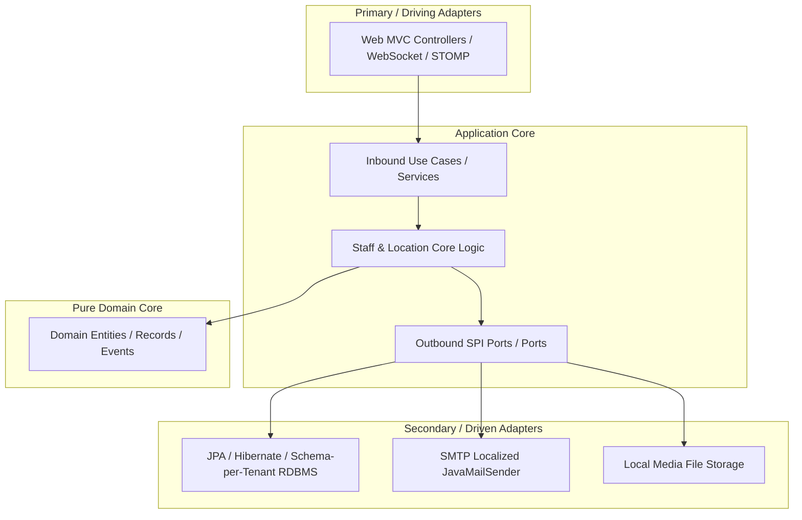

# Project Architecture & Deep Technical Reference (PROJECT.md)

FastBite is a multi-tenant, cloud-native Point-of-Sale (POS) and guest-interactive restaurant ordering system designed around clean **Hexagonal Architecture** and Spring Boot 4.x. It features dynamic database schema partitioning, multi-location SSO session sharing, and complete GraalVM Native Image compiler optimization.

---

## 1. Technological Architecture



### Module Responsibilities

1. **`domain`**:
   * Pure Java structures (e.g. [`Order`](file:///d:/git/fastbite/fastbite/domain/src/main/java/es/brasatech/fastbite/domain/order/Order.java), [`TenantLocation`](file:///d:/git/fastbite/fastbite/domain/src/main/java/es/brasatech/fastbite/domain/tenant/TenantLocation.java)) free of framework annotations. Holds immutable domain records, validations, and custom business exceptions.
2. **`application`**:
   * Houses core orchestration services (e.g., [`OwnerStaffService`](file:///d:/git/fastbite/fastbite/application/src/main/java/es/brasatech/fastbite/application/tenant/OwnerStaffService.java)) and use-case port interfaces. Manages transactional boundaries and business processes.
3. **`adapter-in (web)`**:
   * Presentational adapters handling incoming HTTP requests, WebSocket connections, security sessions, and Thymeleaf view compilation.
4. **`adapter-out`**:
   * Outbound integration handlers:
     * `jpa`: Manages Hibernate connections, dynamic database schema migrations, and entity representations.
     * `email`: Renders and delivers localized customer order receipts.
     * `disk-filestorage`: Manages user-uploaded media files under the `./uploads` directory.

---

## 2. Multi-Tenant & Multi-Location Strategy

FastBite runs as a single-instance SaaS platform partitionable into multiple distinct restaurant groups (tenants) with multiple locations (branches).

### Subdomain Hostname Resolution
Tenant contexts are dynamically extracted from incoming HTTP Host headers (e.g. `pizza.localhost:8080` resolves `tenantId = pizza`).

* **Reserved Paths**: Specific administrative endpoints (like `/signup`, `/login`, `/owner/**`, static assets, and Webhook APIs) are registered as platform-level reserved paths. Requests targeting these endpoints automatically clear the tenant database context to query the global `PUBLIC` schema.
* **SSO & Wildcard Session Cookies**: During authentication, session cookies are configured with a wildcard domain (`.localhost`), enabling platform Owners to log in once at the landing page and immediately gain administrative access across all branch consoles without re-authenticating.

### Database Partitioning (Schema-per-Tenant)
* **Master Schema (`PUBLIC`)**: Houses global user mappings, subscription details, location mappings, and core platform roles.
* **Tenant Schemas (`tenant_{id}`)**: Dynamically provisioned on demand when an owner registers a new branch location. The system executes the base `schema.sql` template on a custom H2 database schema connection to isolate menus, order tables, cashier accounts, and branch transactions.

---

## 3. Thymeleaf 3.1+ AOT Security Guidelines

To prevent Cross-Site Scripting (XSS) and maintain compatibility with Ahead-Of-Time (AOT) GraalVM compilation, the project enforces strict rules on Thymeleaf expressions:

1. **No String Expressions in Event Attributes**:
   * Thymeleaf 3.1+ disables rendering variable strings inside inline javascript handlers (like `onclick="..."`). 
   * **Wrong**: `th:onclick="'openModal(\'' + ${loc.id} + '\')'"`
   * **Correct**: Utilize custom data attributes and read properties via standard DOM queries:
     ```html
     <button th:data-tenant="${loc.tenantId}" onclick="openModal(this.getAttribute('data-tenant'))">
     ```
2. **Strict Reflection Hints**:
   * All records, DTOs, and session attributes serialized to JSON or read by Thymeleaf SpEL must be registered in [`WebAdapterHints.java`](file:///d:/git/fastbite/fastbite/adapter-in/web/src/main/java/es/brasatech/fastbite/config/WebAdapterHints.java).

---

## 4. Building GraalVM Native Images

A native image compiles compiled bytecode directly into machine code, dropping cold-start boot times to under 100ms.

### Step-by-Step Compilation:
1. Ensure your current system uses a compatible **GraalVM JDK 25**.
2. Run the native Maven profile compilation:
   ```bash
   mvn clean package -Pnative -pl webapplication -am
   ```
3. Locate the compiled executable inside the `webapplication/target` directory. Run it directly with your active JPA configuration:
   ```bash
   # Windows
   .\webapplication\target\fastbite.exe --spring.profiles.active=jpa
   ```
