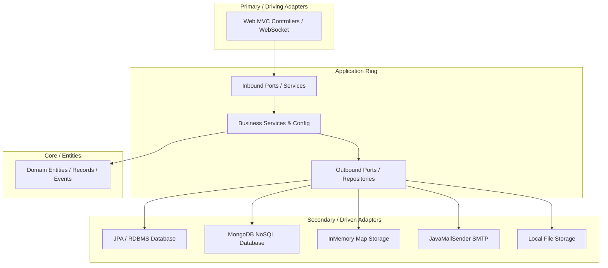

# Project Architecture & Guidelines (PROJECT.md)

Fast-food ordering system with a multi-persistence architecture, database-level field-level internationalization, and real-time dashboard updates.

---

## 1. Tech Stack Overview

*   **Backend**: Spring Boot 3.5.7, Java 25 (utilizing Records, Pattern Matching, and modern constructs)
*   **Templating & Rendering**: Thymeleaf server-side HTML rendering (HTML5/Bootstrap 5.3.0, Font Awesome 6.4.0)
*   **Persistence Profiles**: JPA (H2/PostgreSQL/MySQL), MongoDB, and InMemory (ConcurrentHashMap-based)
*   **Mail Engine**: Spring Mail integrated with Thymeleaf templates for localized text/HTML notification delivery
*   **Real-time Communication**: Spring WebSocket / STOMP for live order dashboard status synchronization

---

## 2. Hexagonal Architecture Implementation

The project is structured as a decoupled ports-and-adapters architecture to isolate core business rules from presentation layers, databases, and third-party APIs.



### Module Responsibilities

1.  **`domain`**:
    *   Contains business models (e.g., [Order.java](file:///d:/git/fastbite/fastbite/domain/src/main/java/es/brasatech/fastbite/domain/order/Order.java), [ProductDto.java](file:///d:/git/fastbite/fastbite/domain/src/main/java/es/brasatech/fastbite/domain/product/ProductDto.java)), custom exceptions, domain events, and core enums.
    *   No framework dependencies (e.g., JPA `@Entity` annotations, `@Document` annotations).
2.  **`application`**:
    *   Declares inbound ports (use cases like [OrderService.java](file:///d:/git/fastbite/fastbite/application/src/main/java/es/brasatech/fastbite/application/order/OrderService.java)) and outbound ports (SPI/Repositories like [EmailRepository.java](file:///d:/git/fastbite/fastbite/application/src/main/java/es/brasatech/fastbite/application/mail/EmailRepository.java)).
    *   Handles orchestration, transaction boundaries, and triggers domain/integration event dispatching.
3.  **`adapter-in` (`web`)**:
    *   Implements UI presentation layer using Thymeleaf, handling user requests, HTTP sessions, CSRF validation, and WebSocket mappings ([WebConfig.java](file:///d:/git/fastbite/fastbite/adapter-in/web/src/main/java/es/brasatech/fastbite/config/WebConfig.java), [OrderController.java](file:///d:/git/fastbite/fastbite/adapter-in/web/src/main/java/es/brasatech/fastbite/controller/OrderController.java)).
4.  **`adapter-out`**:
    *   Provides secondary adapter implementations, separated into technological sub-modules:
        *   `jpa`: Entity mappings, repository interfaces, and `*ServiceJpaImpl`.
        *   `email`: Localized Thymeleaf rendering and SMTP message transmission.
        *   `disk-filestorage`: Local filesystem persistence for uploaded media.

---

## 3. Multi-Persistence Strategy

The codebase switches its persistence mechanism transparently depending on the active Spring Profile: `inmemory` or `jpa`.

| Strategy | Profile | Package Pattern | Package Location | Excludes Configuration |
| :--- | :--- | :--- | :--- | :--- |
| **InMemory** | `inmemory` | `*.inmemory` | Located within adapters | Disables database auto-configuration |
| **JPA** | `jpa` | `*.jpa` | `adapter-out` module | - |

### Isolation Rules
*   **Strict Package Separation**: JPA classes must remain in `*.jpa` packages.
*   **Conditional Scanning**:
    *   [JpaConfig.java](file:///d:/git/fastbite/fastbite/adapter-out/jpa/src/main/java/es/brasatech/fastbite/jpa/order/JpaConfig.java) enables JPA repositories via `@EnableJpaRepositories` only when the `jpa` profile is active.

---

## 4. Internationalization (I18n) Architecture

The core tenet of FastBite's translation strategy is to **isolate translation data** to prevent overhead during queries in the default locale.

### Storage Strategy
*   **Main Tables/Collections**: Store default locale strings directly (e.g., `name`, `description`).
*   **Translation Tables/Collections**: Maintain translations mapped to the default record's ID, field name, and language code (e.g., `product_translations`, `customization_option_translations`).

### Query Flow & Fallbacks
1.  **Locale Check**: If `RequestedLocale == DefaultLocale`, the application bypasses translation tables entirely (**Fast Path**).
2.  **Fallback Check**: If `RequestedLocale != DefaultLocale`, the application queries translation tables.
    *   If a specific translation exists: The application merges it into the response DTO.
    *   If the translation is null or missing: It falls back to the default language field.
    *   If the default language field is missing: It resolves to `null`.

```
[Request with Locale "es"]
       │
       ▼
Is Spanish the Default? ── Yes ──► Return Default Entity Field (Fast Path)
       │
       No
       ▼
Query Spanish Translation Table ── Found? ── Yes ──► Return Translated Value
       │
       No
       ▼
Return Default Entity Field (Fallback)
```

### Order Customizer I18n
The customization options chosen in an order (e.g., "Extra Cheese") must be preserved in the order's language at the time of retrieval, but stored consistently inside the database.

*   **Order Save Process**:
    *   If `orderLanguage != defaultLanguage`: For every customizer option selected, look up the option ID in the repository, retrieve its name in the **default language**, and save it in default language text.
    *   If `orderLanguage == defaultLanguage`: Store customization option names directly.
*   **Order Retrieval Process**:
    *   If `orderLanguage == defaultLanguage`: Return stored data directly.
    *   If `orderLanguage != defaultLanguage`: Look up matching translations for each option ID from `CustomizationOptionTranslationRepository` using the `orderLanguage` key, replacing default names with translated names (falling back to default values if not translated).

---

## 5. Coding Standards & Restrictions

To keep the application highly consistent and support native GraalVM image compilation:

### Front-End & Javascript
*   ❌ **No Inline Styles**: All layouts must use Bootstrap 5 utility classes or classes declared in `menu.css`.
*   ❌ **No Local/Session Storage**: Session state (e.g., the user's cart) must be kept strictly on the HTTP server session.
*   ✅ **Strict Equality**: Always use `===` and `!==` in javascript scripts.
*   ✅ **Navigation**: Use `window.location.assign(url)` instead of modifying `.href` to prevent security issues.
*   ✅ **CSRF Protections**: All state-modifying requests (forms, AJAX POSTs) must pass the `_csrf` token header or parameter.

### Thymeleaf & Fragment Patterns
*   **Fragment Data Enrichment**: Avoid complex property evaluation (e.g., Enums, complex Records) within SpEL expression blocks inside fragments. Pre-process and format values (e.g., invoke `.name()` on enums, pre-calculate totals) within the controller before passing data to Thymeleaf fragments.
*   **AJAX Updates**: Retrieve server-side rendered HTML fragments via AJAX fetches, replacing DOM nodes rather than generating HTML markup client-side.

### AOT and Native Image Requirements
*   **Reflection Configuration**: Register all DTOs, domain models, and JSON-serialized records within [WebAdapterHints.java](file:///d:/git/fastbite/fastbite/adapter-in/web/src/main/java/es/brasatech/fastbite/config/WebAdapterHints.java) to guarantee reflective access in native images.

---

## 6. Hexagonal Architecture Improvement Suggestions

To fully leverage the hexagonal architecture and improve dynamic capability:

### A. Modular Feature Packages (Package-by-Feature)
Currently, code is organized in technical modules (`adapter-in`, `adapter-out`, `application`, `domain`) containing all features (e.g., `order`, `office`, `mail`) nested inside.
*   **Improvement**: Group features into independent modules or package namespaces where each module (e.g., `order-feature`, `menu-feature`) contains its own inner domain, application services, and adapters. This makes it trivial to drop or replace entire feature modules.

### B. Config Switches & Dynamic SPI Bindings
If the system needs to toggle features (e.g., switching from Local Disk Storage to Cloud Storage, or toggling Stripe payment capabilities):
*   **Improvement**: Define Feature Flag configurations and use `@ConditionalOnProperty` to load alternate outbound adapter implementations without restarting or rebuilding the runtime environment.

### C. Shared SPI Interfaces for Multi-Persistence
Instead of repeating service implementations across different profiles:
*   **Improvement**: Declare a unified Repository/SPI interface in the `application` layer. Let JPA and InMemory repository adapters implement this port directly, preventing services from needing conditional profiles (`*ServiceJpaImpl` vs `*ServiceInMemoryImpl`) and consolidating service logic into a single service implementation.
