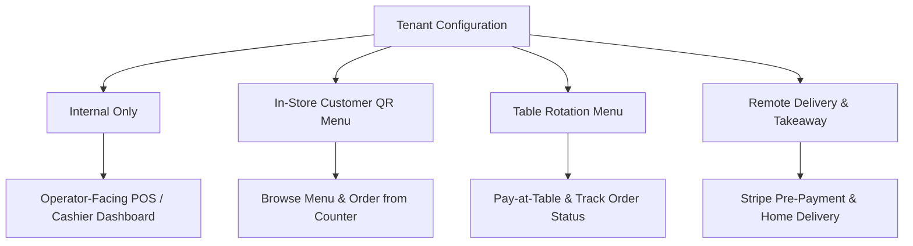
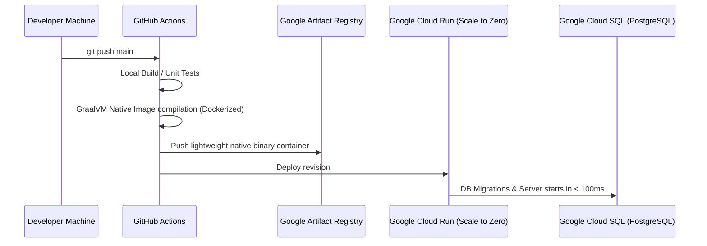

# FastBite Roadmap

This document outlines the product evolution, configuration patterns, development milestones, and deployment strategies for **FastBite**, from its humble beginnings to a scalable, multi-tenant, cloud-native SaaS platform.

---

## 1. The Origin Story: From Kebab Shop to SaaS

FastBite was born in a bustling local kebab shop in the heart of Lisbon. Observing daily operations revealed several friction points in fast-food dining that custom software could solve:

*   **Language Barriers**: A high volume of international tourists struggled to communicate customization preferences (e.g., "no onions," "extra garlic sauce") to staff, leading to frequent order mistakes.
*   **Order Retrieval & Queue Delays**: Customers lost valuable time standing in line just to pick up their orders or verify if their meal was ready, creating unnecessary counter congestion.
*   **Foreigner Ordering Difficulties**: Menus lacked clear translations, forcing visitors to point at pictures or guess ingredients.
*   **Rigid Payment & Fulfillment Models**: Customers lacked flexibility. The shop needed to support quick transitions between cash vs. card payments, and in-store ordering vs. remote takeaway, without maintaining separate, disconnected software systems.

FastBite was developed to bridge these gaps, offering a multi-lingual, high-performance, and lightweight order flow suitable for both operators and customers.

---

## 2. Configurable Product Modes

FastBite is designed to support multiple operational configurations per tenant (configured in database settings or tenant configuration files):



*   **Internal Only**: Standard Cashier POS layout with Cook and Waiter dashboards. No public-facing customer menus.
*   **In-Store Customer QR Menu**: QR codes placed on walls or standees. Customers scan to browse the menu in their preferred language and order at the counter.
*   **Table Rotation Order/Payment**: QR codes tied to specific tables. Customers order, add customizations, and pay directly to rotate tables faster.
*   **Remote Delivery & Takeaway**: Configurable combinations allowing web-based takeaway or delivery with pre-configured radiuses and operating hours.

---

## 3. Feature Roadmap

The upcoming releases focus on expanding customer capabilities, adding themes, and enabling multi-tenant SaaS features:

### Phase 5: Customer QR & Order Flows (Q3 2026)
*   **Table Ordering (QR Flow)**:
    *   Dynamic QR code generation bound to specific table IDs (e.g., `/menu?table=12`).
    *   Session-based shopping carts mapped to tables, preventing cross-table ordering conflicts.
*   **Takeaway & Delivery Ordering**:
    *   **Stripe Integration**: Secure pre-payment processing.
    *   **Pre-Payment Locks**: Order is only dispatched to the Cook/Cashier dashboard (`CREATED` state) after Stripe webhook confirms successful payment.
    *   **Delivery Boundaries**: Delivery address verification and basic distance-based pricing.

### Phase 6: Design & Personalization (Q4 2026)
*   **CSS Theme Harmonization**:
    *   Pre-configured Bootstrap-based theme layouts: **Cafe** (cozy, warm tones), **Modern Restaurant** (minimalist dark/light mode), and **FastFood** (vibrant, high-contrast).
    *   Theme variables defined in standard Thymeleaf layouts using CSS custom properties (variables) configurable via the BackOffice.
*   **Dynamic Promos & Disounters**:
    *   Support for "Buy X Get Y Free" or percentage-based discount codes.
    *   Time-restricted validity for lunch specials or happy hours.

### Phase 7: Multi-Tenant SaaS Platform (Q1 2027)
*   **Tenant Signup & Self-Provisioning**:
    *   Automated registration flow via a central landing page.
    *   Integration with **Stripe Subscription Billing** (monthly/yearly tiers).
*   **Multi-Tenant Routing**:
    *   **Subdomain routing** (e.g., `tenant1.fastbite.com`) or path-based routing (e.g., `fastbite.com/t/tenant1`).
    *   Dynamic tenant schema switching for JPA (multi-datasource or schema-per-tenant) and database partitioning for MongoDB.
*   **Custom Domain Support**:
    *   Allow enterprise tenants to bind their custom domains (e.g., `orders.mykebab.com`) with automated SSL certification provisioning.

---

## 4. Deployment Strategy

FastBite is engineered for maximum performance, minimal cold-start times, and cost-efficiency.



### Google Cloud Run + Cloud SQL
*   **Scaling to Zero**: Leveraging Cloud Run's scale-to-zero capabilities to eliminate hosting costs during off-hours (nights and holidays).
*   **GraalVM Native Image Compilation**:
    *   Spring Boot applications compile into highly optimized standalone machine binaries using GraalVM.
    *   Reduces startup time from ~5-8 seconds to **under 100 milliseconds**.
    *   Lowers memory footprint, enabling the app to run efficiently on 256MB/512MB Cloud Run instances.
*   **Database Connectivity**: Cloud SQL instances (PostgreSQL) accessed via secure Cloud SQL Auth Proxy with connection pooling optimized for scale-to-zero (rapid termination and startup of connections).

### Build Pipeline

#### 1. Local Builds
Developers run standard JVM builds for fast iteration cycles:
```powershell
mvn clean install
mvn spring-boot:run
```

#### 2. Native Image Build Flow
To package and verify native compilation locally before cloud delivery:
```powershell
# Compiles and tests the application as a native binary locally (requires GraalVM)
mvn -Pnative native:compile

# Or build a containerized native image using Cloud Native Buildpacks (Docker required)
mvn spring-boot:build-image -Pnative
```
All DTOs and reflection-sensitive classes are declared in [WebAdapterHints.java](file:///d:/git/fastbite/webapplication/src/main/java/es/brasatech/fastbite/config/WebAdapterHints.java) to ensure full reflection access for Thymeleaf SpEL rendering inside the compiled native image.
